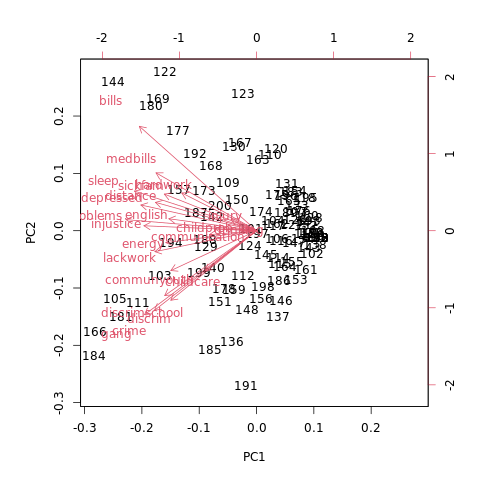

# Introduction

It is not an overstatement to say that the default output for a Principal Components Analysis (PCA) biplot in R is <i>gross</i>.  The image below is the default biplot generated for the farm stress data discussed in detail <a href="https://www.waderstats.com/using-principal-components-analysis-pca-to-analyze-latino-stress-by-agricultural-season-and-occupation/" target="_blank">here</a>.  This presentation will show you how to use the output from the <b>prcomp()</b> function with the <i>ggplot2</i> library to create a more aesthetically pleasing and informative biplot [@ggplot2]. 

Throughout, we will use the R programming language and assume the user is using Rstudio to compile their R markdown files into HTML [@Rlang2020; @Rstudio2020].  If you want to follow along with the R markdown, it is downloadable  <a href="https://waderstats.com/rstudio-files/pretty_pca_biplot/pretty_pca_biplot.Rmd" target="_blank">here</a>.  The associated bibliography file is <a href="https://waderstats.com/rstudio-files/pretty_pca_biplot/pretty_pca_biplot.bib" target="_blank">here</a>.  The data can be downloaded <a href="https://waderstats.com/rstudio-files/pretty_pca_biplot/data/farmstress.RData" target="_blank">here</a>.



# Libraries

The libraries <i>knitr</i>, <i>bookdown</i>, <i>kableExtra</i>, and <i>DT</i>, generate the HTML output [@knitr; @bookdown; @kableExtra; @DT]. The <i>ggplot2</i> package is used to generate the final biplot [@ggplot2].

```{r libraries, eval = TRUE, echo = TRUE, results = TRUE, warning = FALSE, message = FALSE}
package_loader <- function(x, ...) {
  if (x %in% rownames(installed.packages()) == FALSE) install.packages(x)
  library(x, ...)
}

packages <- c("knitr", "bookdown", "kableExtra", "DT", "ggplot2")

invisible(sapply(X = packages, FUN = package_loader, character.only = TRUE))
```

# Data Setup

The data are loaded from a previously constructed R data set and then subset only to include observations from the thinning season when the farmworkers are most active. We also remove two columns where there is no variance in the answers of the participants.

```{r pestDataSetup, eval = TRUE, echo = TRUE, results = TRUE, warning = FALSE, message = FALSE}
# Load the data
load("data/farmstress.RData")

# Season when the farm workers are the most active.
farmstressS1 <- na.omit(farmstress[which(farmstress$season == "Thinning"), ])

# There is no variance to quantify in these columns
farmstressS1 <- farmstressS1[, (-1)*which(colnames(farmstressS1) == "violence")]
farmstressS1 <- farmstressS1[, (-1)*which(colnames(farmstressS1) == "druguse")]

# Variable to hold the occupation (e.g. farmworker vs. non-farmworker)
farmstressS1Occupation <- farmstressS1$occupation

# A dataframe that remove occupation and season so it contains only numeric values.
farmstressS1 <- farmstressS1[, c(-1, -2)]
```

# PCA Analysis

The PCA code for farm stress data is shown below.  Generally, any PCA's first step is to scale the data so that each feature is comparable, followed by mean centering, shifting the data on their axes without altering any stochastic properties.  In this specific case, but generally, not so, scaling isn't necessary since each column is measured using the same Likert-type scale.

We use the <b>prcomp()</b> function to do the PCA and subsequently extract the loadings, scores matrix, and feature importance as measured by how much each of the variability each PC axis explains in the observed data.

```{r pcaAnalysis, eval = TRUE, echo = TRUE, results = TRUE, warning = FALSE, message = FALSE}
# Make the features comparable by centering each column around it's mean.  Since the data are already on the same scale, we do not need to also divide by their respective variance (e.g., scale = FALSE).
farmstressS1 <- scale(farmstressS1, center = TRUE, scale = FALSE)

# This function does all of the math to do the PC matrix factorization.
farmstressS1_pca <- prcomp(farmstressS1, center = FALSE, scale. = FALSE, retx = TRUE)

# The loadings (e.g., correlations), scores (e.g., projections) matricies, and importance
farmstressS1_pca_loadings <- farmstressS1_pca$rotation # Loadings Matrix
farmstressS1_pca_scores <- predict(farmstressS1_pca) # Scores Matris
farmstressS1_pca_importance <- summary(farmstressS1_pca)$importance # Explained Variance
```

# PCA Biplot

The PCA biplot goal is to plot the projections of the observed data onto the first two PC axes and how well each of the features from the original feature space load onto the new factorization.  To that end, we can deconstruct the process into five steps:

1. Setup the data to be plotted.
2. Plot the scores.
3. Plot segments showing how well each feature loads onto the first two PCs.
4. Label the axes with the explained variance of the first two PCs.
5. Adjust the plot theme to make it more pretty!

## Setup the Data

The scale of the feature loadings is between zero and one because they are correlations.  Therefore it would be best if the PC axes we want to plot are also on the same scale.  We can achieve this by using a min-max feature scaling approach.

```{r pcStressBiplot1, eval = TRUE, echo = TRUE, results = TRUE, warning = FALSE, message = FALSE, fig.width = 9, fig.height = 7}
# The plot data includes occupation and the first two PC components.
plotDataScores <- cbind(occupation = farmstressS1Occupation, as.data.frame(farmstressS1_pca_scores[, c("PC1", "PC2")]))

# We want to use min-max feature scaling on the scores so they are between zero and one, the same as the loadings.
normalize <- function(x) return ((x - min(x)) / (max(x) - min(x)))

plotDataScores[, "PC1"] <- scale(normalize(plotDataScores[, "PC1"]), center = TRUE, scale = FALSE)
plotDataScores[, "PC2"] <- scale(normalize(plotDataScores[, "PC2"]), center = TRUE, scale = FALSE)

plotDataLoadings <- as.data.frame(farmstressS1_pca_loadings)
```

## Plot the Scores

The first thing to do is plot the scores, and since we have a categorical occupation, color the points as such to see if there is any separation between the two groups.  The default colors are not very nice, so we choose two different (yes, colorblind-friendly!) colors using the <b>scale_color_manual()</b> function.

```{r pcStressBiplot2, eval = TRUE, echo = TRUE, results = TRUE, warning = FALSE, message = FALSE, fig.width = 9, fig.height = 7}
p1 <- ggplot() + 
  geom_point(data = plotDataScores, mapping = aes(x = PC1, y = PC2, colour = occupation)) + 
  scale_color_manual(values = c("#8F57BA55", "#57BA7D55"))

p1
```

# Plot the Loadings

To express the loadings in the two dimensional PC space, we plot arrows that are the same length as to how well each original feature loads onto the PC space as measure by their correlation.

```{r pcStressBiplot3, eval = TRUE, echo = TRUE, results = TRUE, warning = FALSE, message = FALSE, fig.width = 9, fig.height = 7}
p2 <- p1 + 
  geom_segment(data = plotDataLoadings, aes(x = 0, y = 0, xend = PC1, yend = PC2), arrow = arrow(length = unit(0.03, "npc")), alpha = 0.2) + 
  geom_text(data = plotDataLoadings, mapping = aes(x = PC1, y = PC2, label = rownames(plotDataLoadings)), hjust = 1, vjust = -0.2, colour = "darkred", size = 4, check_overlap = TRUE)
```

## Label the Axes

The X and Y labels can also contain information.  In this case, we add the proportion of variance explained by the first two PCs, respectively.

```{r pcStressBiplot4, eval = TRUE, echo = TRUE, results = TRUE, warning = FALSE, message = FALSE, fig.width = 9, fig.height = 7}
p3 <- p2 + 
  xlab(paste("PC1 (", round(farmstressS1_pca_importance["Proportion of Variance", "PC1"]*100, 1),"%)", sep = "")) + 
  ylab(paste("PC2 (", round(farmstressS1_pca_importance["Proportion of Variance", "PC2"]*100, 1),"%)", sep = ""))

p3
```

## Update the Theme

We can make some finish touches by updating the basic theme to make the plot look nicer.

```{r pcStressBiplot5, eval = TRUE, echo = TRUE, results = TRUE, warning = FALSE, message = FALSE, fig.width = 9, fig.height = 7}
p4 <- p3 + 
  theme(axis.line = element_line(colour = "black"),
        panel.border = element_rect(colour = "black", fill = NA, size = 1),
        axis.text = element_text(size = 12),
        axis.text.x = element_text(angle = 50, hjust = 1),
        axis.title = element_text(size = 12),
        legend.title = element_blank(),
        legend.position = "right",
        panel.grid = element_line(color = "lightgray"),
        panel.background = element_rect(fill = "white", colour = "white"))

p4
```

# Session Info

```{r sessionInfo, eval = TRUE, echo = TRUE, results = TRUE, warning = FALSE, message = FALSE}
sessionInfo()
```

# References

<!-- This is needed to resize iframe content. Please ignore if duplicationg this R markdown file --> 
<script type="text/javascript" src="https://www.waderstats.com/wp-includes/js/iframe-resizer/js/iframeResizer.contentWindow.min.js" defer></script>
